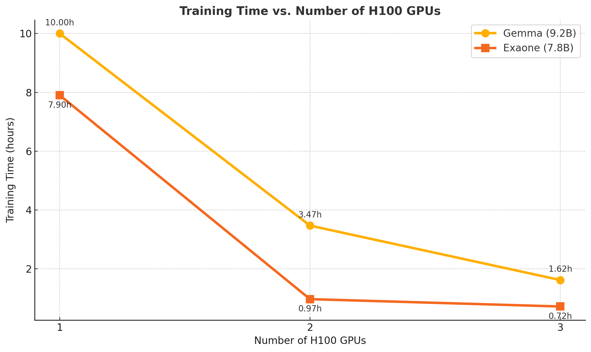
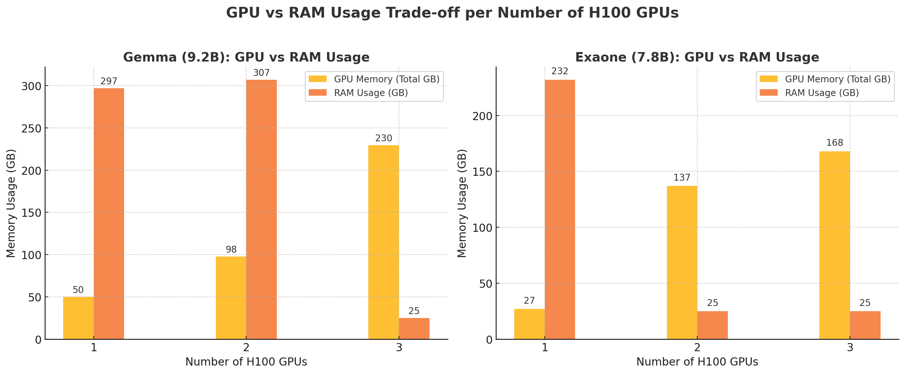
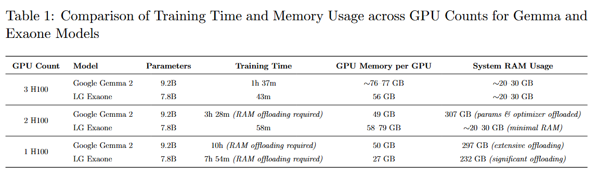

# Train LLMs in Mixed Precision Locally (bf16)

To use this code effectively, you will need a decent amount of computational resources. This repository's code has been tested internally on a server equipped with 3 H100 GPUs for training LLMs.

## Results and Experiments

### 1. Training Time vs. Resource Allocation

The image below illustrates how the training time varies depending on the amount of resources allocated (GPUs, memory):



### 2. GPU vs. RAM Usage Tradeoff

This image shows the tradeoff between GPU memory usage and system RAM consumption during the training process:



### 3. Detailed Experimental Setup

Below is a detailed table summarizing each experiment, configurations, and respective observations:



# Usage Guide

In order to build the container run:

```
docker build -f train_container.dockerfile -t llm-trainer-javis .
```

In order to run it:

```
docker run -it -p 3334:8000 --gpus all llm-trainer-javis bash
```

In order to save it:

```
docker save -o llm-trainer-javis.tar llm-trainer-javis
```

# In order to perform a training:

You will need to run the following command

```
python ds_launcher.py --num_gpus=4 --master_port=29501
```

# Additional information

you may need to change the specific training and test set routes inside of `train_deploy_huggingface.py` as well as the model directory of the model you are trying to train.

### Training Data:

You should put it in the train and validation folder in a .tsv file and it should look similar to this:

```
"[INST] write your prompts here [/INST]
 this is an example of response"
"[INST] write your second prompt here [/INST]
 this is an example of second response"
 "[INST] write your third prompts here [/INST]
 this is an example of third response"
 ...
```
